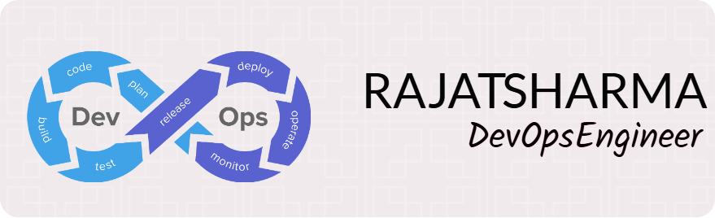

<h3 align="center">👋 Hi there! I'm Rajat Sharma – a DevOps & Cloud Engineer from India 🇮🇳</h3>

---

🔧 **About Me**  
I'm a Google Cloud and AWS Certified Cloud Engineer with strong expertise in DevOps, cloud automation, and infrastructure management.  
Currently working at **CloudTechner** since April 2022, I've built scalable and secure cloud-native solutions using:

- ☁️ **AWS** | **GCP** | **Azure**  
- ⚙️ **Terraform** | **GitHub Actions** | **Jenkins** | **Azure DevOps**  
- 🐳 **Docker** | **Kubernetes** (GKE, AKS)  
- 🔐 **IAM**, **VPC**, **Cloud SQL**, **RDS**, **CloudFormation**, and more  

I’m passionate about automation, infrastructure as code, and integrating AI with DevOps workflows.

---

📫 **Contact Me**

- 📧 Email: [rajatsharma3016@gmail.com](mailto:rajatsharma3016@gmail.com)  
- 💼 LinkedIn: [Rajat Sharma](https://www.linkedin.com/in/rajat-sharma-7290b81a1/)  
- 📷 Instagram: [\_sharmarajat\_\_](https://instagram.com/_sharmarajat__)  

---

📜 **Certifications & Trainings**

- 🏅 **Google Cloud Certified – Associate Cloud Engineer**  
- 🏅 **AWS Certified Solutions Architect – Associate**

---

🛠️ **Technologies & Tools**

  
  
  
  
  
  
  
  
  
  
  
  

---

📈 **GitHub Stats**

  
  

---

💡 **Fun Fact**  
I love solving complex problems using automation and exploring how AI can optimize DevOps processes!
